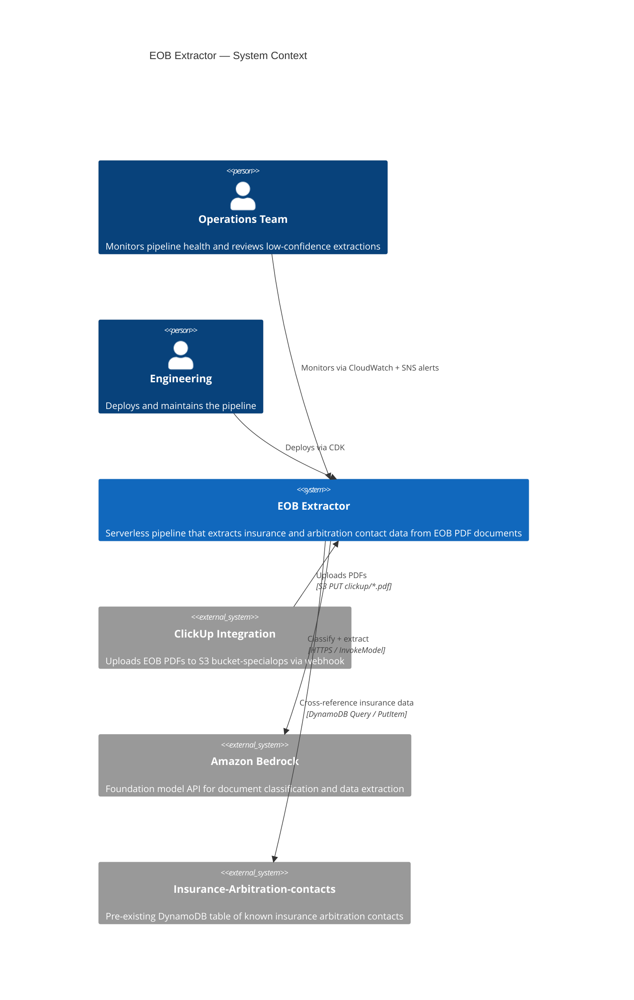
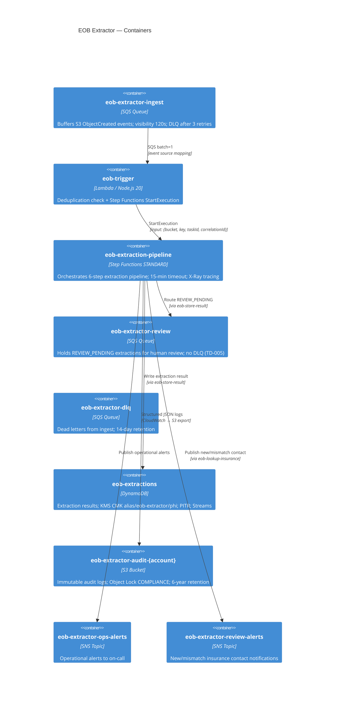
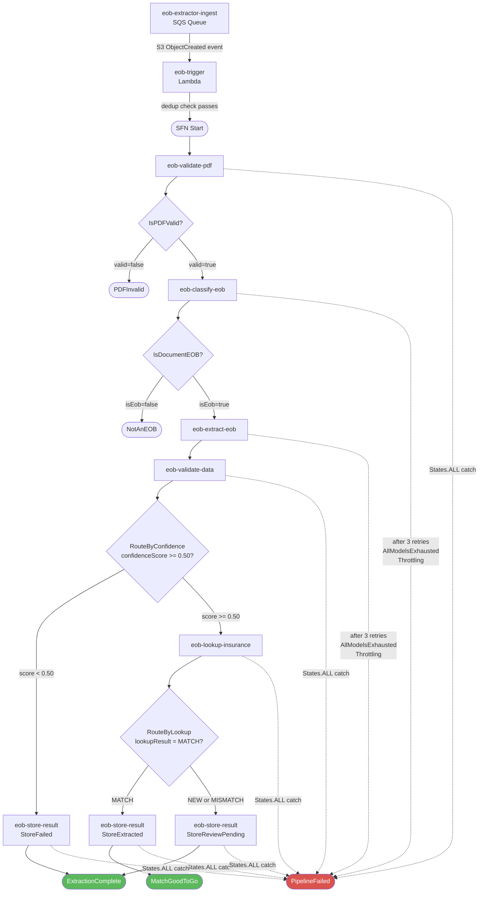
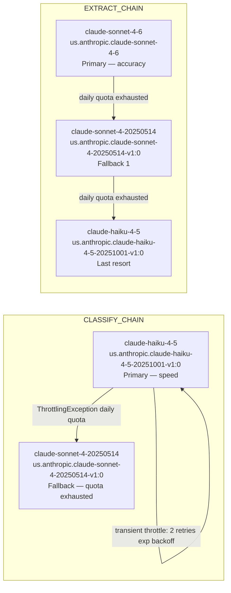
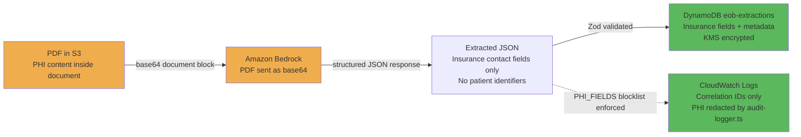
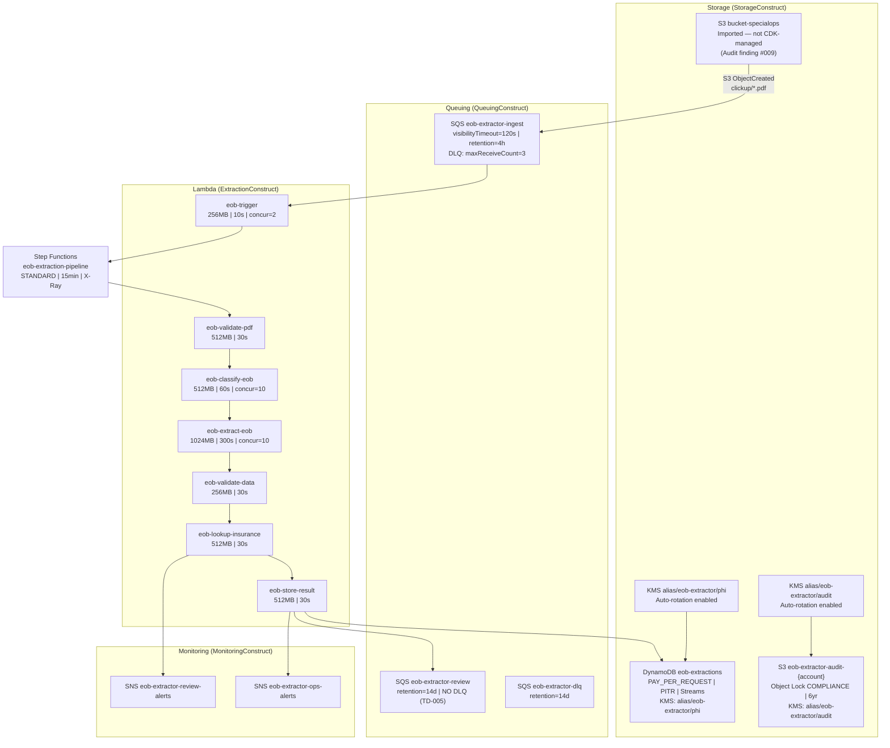

# EOB Extractor — Architecture

**Date:** 2026-06-08 (verified current + migration section added 2026-07-03)  
**Model:** C4 (Context → Container → Component)

---

## 1. System Context



---

## 2. Container Diagram



---

## 3. Step Functions Pipeline — Full Flow



---

## 4. Bedrock Model Fallback Chains



**Retry logic:**
- Transient `ThrottlingException` (not "too many tokens"): retry same model, max 2 retries, exponential backoff (1s × 2^n + jitter up to 1s)
- Daily quota `ThrottlingException` ("too many tokens"): advance to next model immediately
- All other errors: throw immediately, caught by SFN `States.ALL` catch → `PipelineFailed`

---

## 5. Data Flow — PHI Boundary



**PHI handling note:** The PDF is transmitted to Bedrock in-memory as a base64 block and never written to logs. The extracted JSON contains only insurance company details (name, address, arbitration contacts) — not patient-level identifiers. All log paths go through `audit-logger.ts` which enforces the `PHI_FIELDS` blocklist and `sanitizeS3Key()` before emitting to CloudWatch.

---

## 6. Infrastructure — Key AWS Resources



---

## 7. Lambda Architecture Pattern

All Lambda handlers follow the same Clean Architecture + DI pattern:

```
Handler File
├── createHandler(deps) → handler function    ← testable, deps injected
├── Production deps (DynamoDB client, SQS client, etc.)
└── export const handler = createHandler(productionDeps)
```

The handler function contains business logic; the production wiring at the bottom creates real AWS clients. Tests inject mocks via `createHandler`.

---

## 8. Migration Considerations (sandbox → production)

Risk-ordered checklist for promoting this POC to the production account:

1. **VPC attachment first (Finding #002)** — do not replicate the sandbox's no-VPC posture in production; PHI workloads require VPC-attached Lambdas + VPC endpoints per Medwork convention. This is the top architectural gap.
2. **Bucket switch** — sandbox reads `bucket-specialops-sandbox`; production is `bucket-specialops` (`clickup/{taskId}/` prefix). The bucket is NOT managed by this CDK app (Finding #009) — the S3 event notification to the ingest queue must be recreated manually against the prod bucket.
3. **KMS keys** — recreate both CMKs (PHI + audit) in the prod account; all log groups, `eob-extractions`, queues, and SNS re-encrypt against the new keys. Verify key policies before first invoke.
4. **`Insurance-Arbitration-contacts` dependency** — the lookup table lives in the Arbitration platform's account/stack (read-only external dependency, Finding #007). Cross-check table name, region, and the reader role's grant in prod.
5. **Bedrock model access + quotas** — the fallback chain (`us.anthropic.claude-sonnet-4-6` → `sonnet-4-20250514` → `haiku-4-5`) needs model access in the prod account and quota headroom for 1K–10K docs/month; the `us.*` profiles route across us-east-1/2 + us-west-2, so IAM must allow all three regions.
6. **Permission boundary** — `permission-boundary.aspect.ts` applies the boundary to every role; confirm the prod account's boundary policy name matches or parameterize it.
7. **Review-queue operations** — `eob-extractor-review` has no DLQ (Finding #005) and no consumer beyond humans; define the prod review workflow (who drains it, SLA) before go-live.
8. **CI gates** — the GitHub Actions workflow has no SAST/dependency-scan step (audit finding from the 2026-05 smoke test); add Semgrep + npm audit gates before prod deploys.
9. **Data migration** — none required (extractions are derived data; re-extraction from source PDFs is the recovery path — see RB-005 for PITR).
